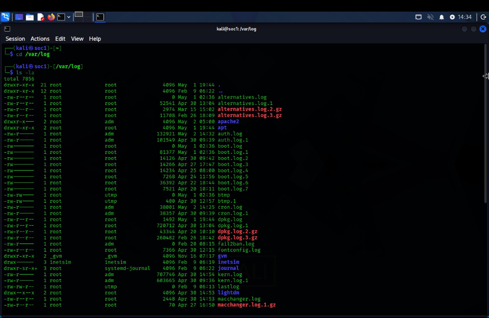
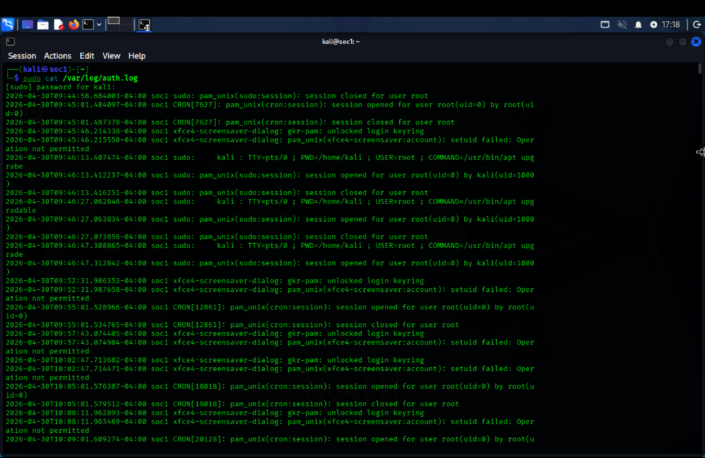
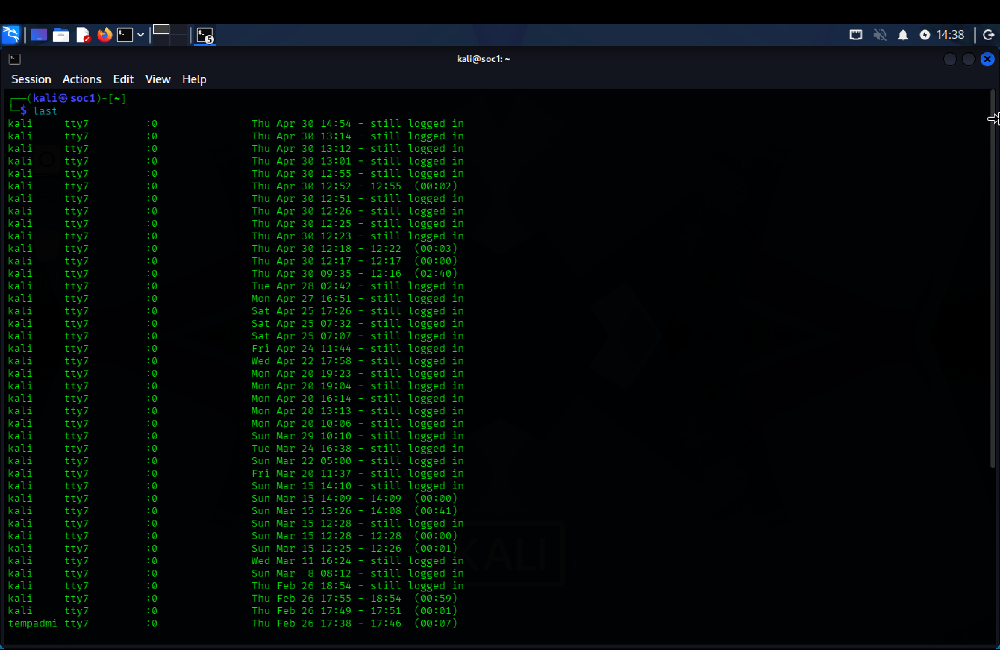
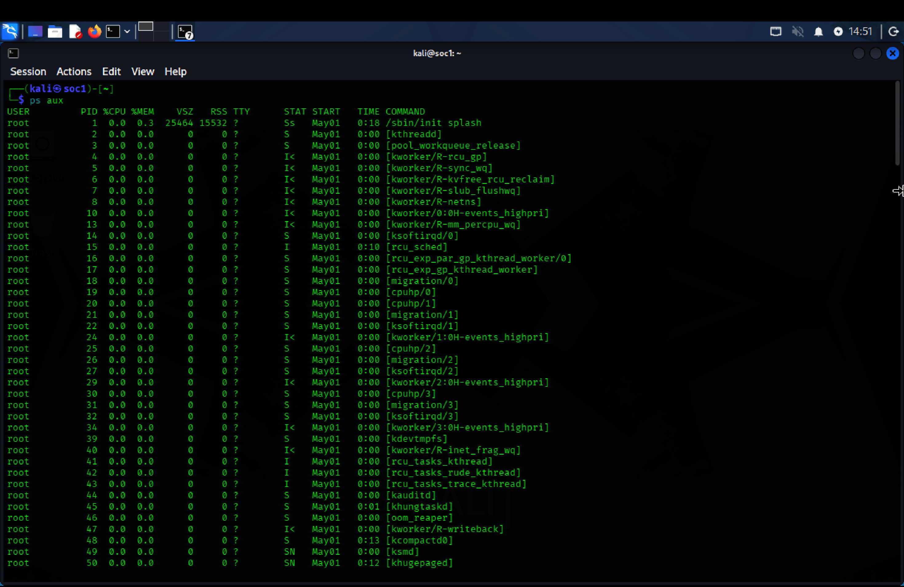
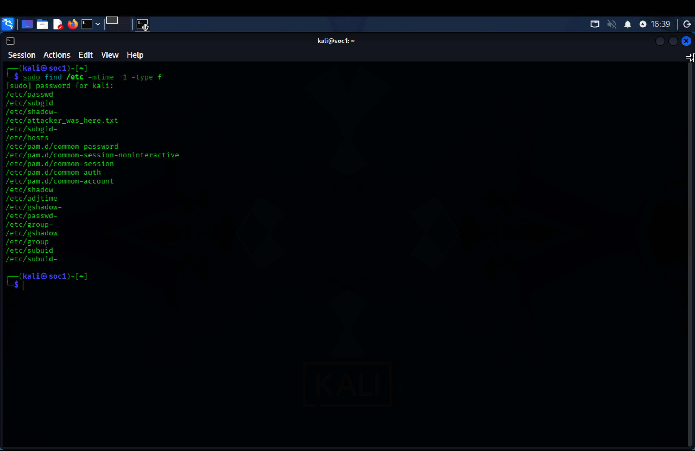
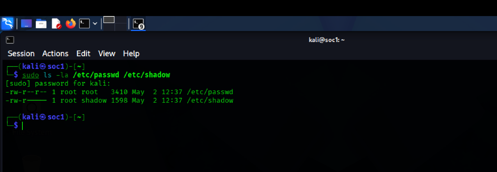
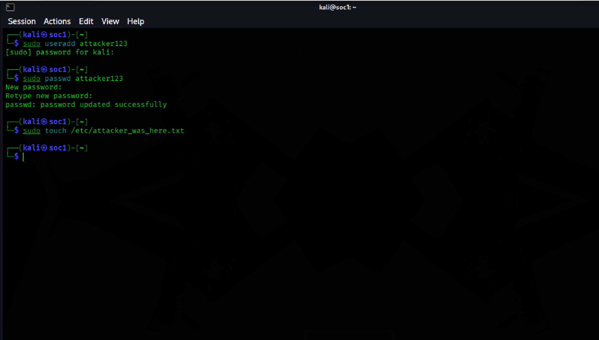
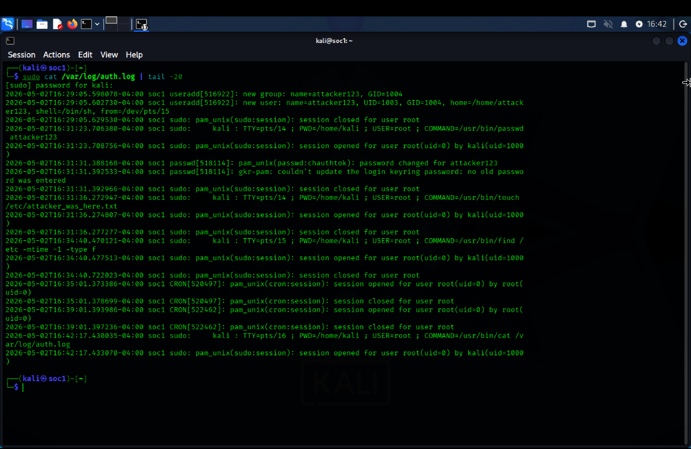

# Linux Log Analysis and File Integrity Investigation

Working a Linux host from the command line: reading auth.log for brute force, checking what is running, and verifying whether an attacker left anything behind in /etc.

## At a Glance

| Field | Detail |
| --- | --- |
| Alert Type | Suspicious SSH activity and possible persistence |
| Severity | High |
| Detection Method | Authentication log analysis, process inspection, file integrity checks |
| Tools Used | auth.log, last, ps aux, find |
| Host | Kali Linux, lab victim machine |
| Outcome | Brute force confirmed in logs, attacker persistence simulated and detected |

## What Happened

A Linux host was investigated for unauthorised SSH access and signs that an attacker had established a foothold.

The order matters. Logs tell you someone tried. Processes tell you what is running now. File integrity tells you what they left behind. Checking only the first one answers a third of the question.

## Log Directory Overview



The log storage structure was reviewed first to confirm which forensic sources existed on the host before relying on any of them.

## Failed Login Attempts



/var/log/auth.log was inspected directly.

Multiple failed SSH authentication attempts were present, originating from an external IP, cycling through different usernames.

Username cycling is the distinction that matters. Repeated failures against one account is someone guessing a password. Failures across many accounts is someone guessing who exists. Both are brute force, but they tell you different things about what the attacker knows.

## Login History Review



Successful sessions were reviewed with timestamps and user context.

Failures alone are only half an investigation. The question that closes it is whether anything succeeded, and from where. Any session from an unrecognised IP or account is treated as suspicious until it is explained.

## Process Inspection



Running processes were enumerated with ps aux to establish what was actually executing on the host.

Logs are history. Processes are the present. If an attacker got in and ran something, the log tells you they arrived, but the process list tells you they are still here.

What earns attention: binaries with no known parent, scripts running outside a package path, background services that nobody scheduled.

## File Integrity, /etc Directory



Recently modified configuration files under /etc were checked for unauthorised changes.

/etc is where a Linux system keeps its rules. An attacker who reaches it is not visiting, they are moving in.

## Critical System Files



Integrity was verified on the two files that define who can authenticate:

/etc/passwd, the account list.

/etc/shadow, the password hashes.

A timestamp change on either one is not a maintenance event. It means the account model of the host changed, and someone needs to explain why.

## Persistence Simulation



A test account was created on the host to simulate attacker persistence, and the system response was verified.

The account creation surfaced in the logs. That is the check the whole lab exists to run: not whether an attacker can add a user, but whether the host records it when they do.

## Log Validation



The tail of auth.log was reviewed to trace the most recent authentication and system activity, confirming the brute force and the account creation both landed in the log where they should.

## Indicators Observed

Multiple failed SSH authentication attempts from an external IP.

Username cycling consistent with automated guessing.

Unauthorised user account creation.

Modification activity under /etc.

Process activity requiring validation against known good baseline.

## MITRE ATT&CK Mapping

| Behaviour | Technique ID | Description |
| --- | --- | --- |
| Repeated SSH authentication failures | T1110 | Brute force |
| Session from unrecognised source | T1078 | Valid accounts |
| Unauthorised account creation | T1136 | Create account, persistence |
| Execution on host | T1059 | Command and scripting interpreter |
| Configuration file modification | T1112 | Modify system settings |

## Analyst Conclusion

SSH brute force confirmed in auth.log from an external source IP.

Attacker persistence via account creation simulated and successfully detected in the logs.

File integrity checks on /etc and the authentication files completed, giving a documented baseline to compare against.

Activity was lab controlled. No real compromise occurred.

## Recommended Response

Enforce SSH key authentication and disable password login.

Disable direct root login over SSH.

Alert on new user account creation rather than discovering it during a manual check.

Deploy file integrity monitoring, AIDE or Tripwire, so /etc changes fire an alert instead of waiting for an analyst to run find.

Investigate any unrecognised process against a known good baseline.

## Linux Security Log Quick Reference

| Log File | Location | What It Contains | Why It Matters |
| --- | --- | --- | --- |
| auth.log | /var/log/auth.log | Login attempts, SSH events | Brute force, unauthorised access |
| syslog | /var/log/syslog | General system activity | Anomaly detection |
| kern.log | /var/log/kern.log | Kernel messages | Rootkit indicators |
| bash_history | ~/.bash_history | User command history | Attacker command trace |
| wtmp and btmp | /var/log/ | Login success and failure history | Session forensics |
| cron | /var/log/cron.log | Scheduled job activity | Persistence mechanisms |
| apache2 | /var/log/apache2/ | Web server requests | Web attack detection |

## What This Lab Demonstrates

Reading Linux authentication logs from the command line, not from a dashboard.

Distinguishing password guessing from account enumeration in the same log.

Correlating authentication evidence with live process state.

Checking file integrity on the files that decide who can log in.

Simulating persistence and verifying the host actually records it.

Mapping the full chain to MITRE ATT&CK.

## Repository Structure

```
.
├── README.md
├── screenshots/
│   ├── log_directory.png
│   ├── auth_logs.png
│   ├── login_history.png
│   ├── ps_ax.png
│   ├── etc_modified.png
│   ├── critical_files.png
│   ├── simulation_changes.png
│   └── auth_log_tail.png
```

---

[](https://linkedin.com/in/WilliamInCyber)
[](https://x.com/WilliamInCyber)
